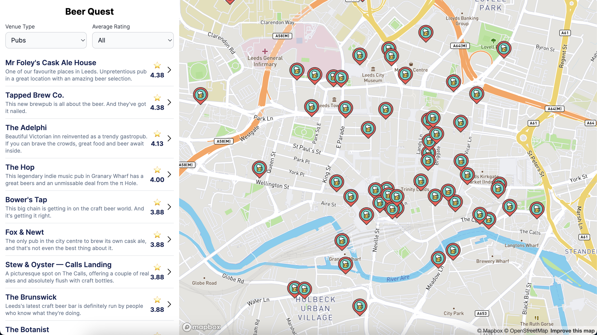

# Beer Quest

This application helps you find a place to drink in Leeds based on the [Leeds Beer Quest](https://datamillnorth.org/dataset/e1dzd/leeds-beer-quest) dataset.

The app consists of two components:

- A frontend using React with Next.js (static only).
- A backend using .NET 8.

## Prerequisites

- Node v18 or above.
- .NET 8 SDK.
- The `NEXT_PUBLIC_MapboxAccessToken` variable should be set in `/frontend/.env` with a valid [Mapbox](https://www.mapbox.com/) token.
- Docker (optional - for running the app only, not development).

## Running the app

**Important:** The Mapbox token should be set first, see Prerequisites.

The simplest way to run the app is with Docker. Run `docker compose up` from the root of the repository. This exposes both the frontend (port 3000) and backend (port 5153) to the host.

Once running browse to [http://localhost:3000](http://localhost:3000/).

## Development

### Frontend

- All commands should be ran inside the `frontend` directory.
- Install dependencies with `npm install`.
- Provide a [Mapbox](https://www.mapbox.com/) token in `.env` (for demo purposes this may have been provided to you).
- Run the development server with `npm run dev` and browse to [http://localhost:3000](http://localhost:3000/).
- Formatting is provided by prettier and can be ran with `npm run format`.
- [Tailwind CSS](https://tailwindcss.com/) is used as a CSS framework.
- Two types of tests are used:
    - Cypress Component tests to verify components in isolation and through specific scenarios. Run with `npm run cypress:run:component`.
    - Cypress end-to-end tests to mimick the user journey through the app. Run with `npm run cypress:run`. **Note:** The dev server must be running first and the Mapbox token must be set (see prerequisites).

### Backend

**Note:** The backend should be ran on port 5153 to support the frontend component.

For demo purposes the app uses a SQLite database that is committed to source control. The database already contains the Leeds Beer Quest dataset.

The DB is managed and accessed by EFCore which has a few useful commands:

- Install the EFCore CLI: `dotnet tool install --global dotnet-ef`.

- Create a new database migration: `dotnet ef migrations add YourMigrationName --project BeerQuest.Infrastructure/BeerQuest.Infrastructure.csproj`.

- Update the database with any unapplied migrations: `dotnet ef database update --project BeerQuest.Infrastructure/BeerQuest.Infrastructure.csproj`.

The backend is integration tested using XUnit and ASP.NET's `TestServer` to test the entire request pipeline, including filters and middleware. See `GetVenuesTests.cs` for an example. Run from VS or Rider, or with `dotnet test`.

Swagger is used to provide API documentation. It can be viewed [here](http://localhost:5153/swagger/index.html) when the backend is running.

## Known Issues

- For best results use a tablet or desktop. Support for mobile viewports hasn't been worked on.

## Attribution

- Leeds Beer Quest [dataset](https://drive.google.com/file/d/1o5JTtFUHcBAjH47z4i_eZrFdyXvSzY_S/view).
- Marker icons created by [André Luiz Gollo - Flaticon](https://www.flaticon.com/free-icons/marker).
